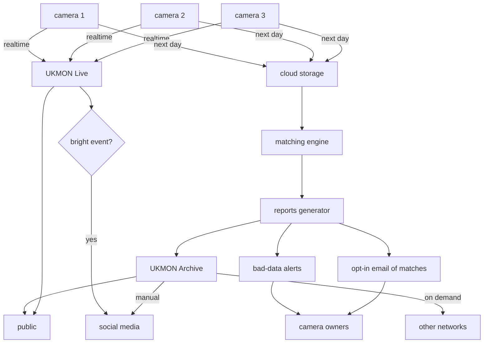
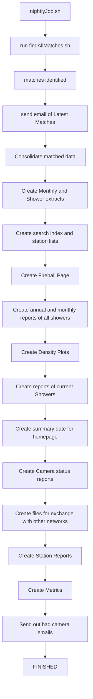
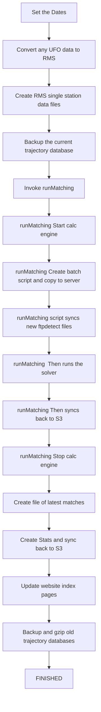

UKMON Archive and UKMON Live data flows
=======================================
This diagram shows the overall flow of data from Cameras to websites and out to the public.

Daily Batch Process
===================
This diagram shows the various scripts and processes called, in order

Find All Matches
================
Flow in findAllMatches.sh

