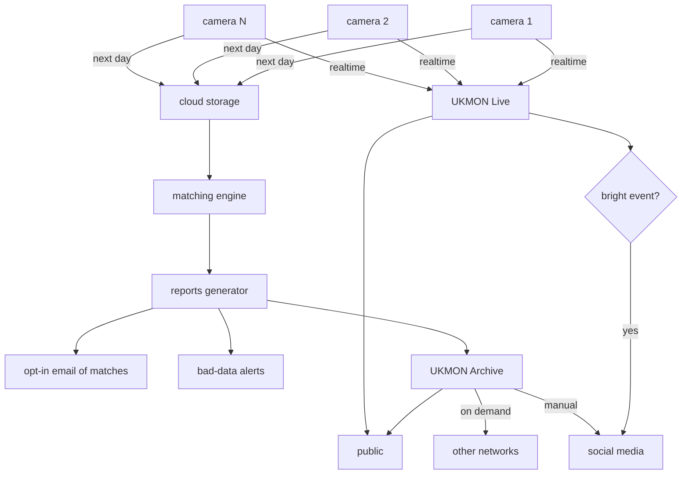

README for UKMON Archive

```mermaid
    flowchart TD
    A[camera 1] -- realtime --> C[UKMON Live];
    B[camera 2] -- realtime --> C;
    B1[camera N] -- realtime --> C;
    A -- next day --> D[cloud storage];
    B -- next day --> D;
    B1 -- next day --> D;
    D --> E[matching engine];
    E --> F[reports generator];
    F --> G[opt-in email of matches];
    F --> I[bad-data alerts];
    F --> H[UKMON Archive];
    H -- on demand --> J[other networks];
    H --> M[public];
    C --> M[public];
    C --> N{bright event?};
    N -->|yes| K[social media];
    H -- manual --> K;
```