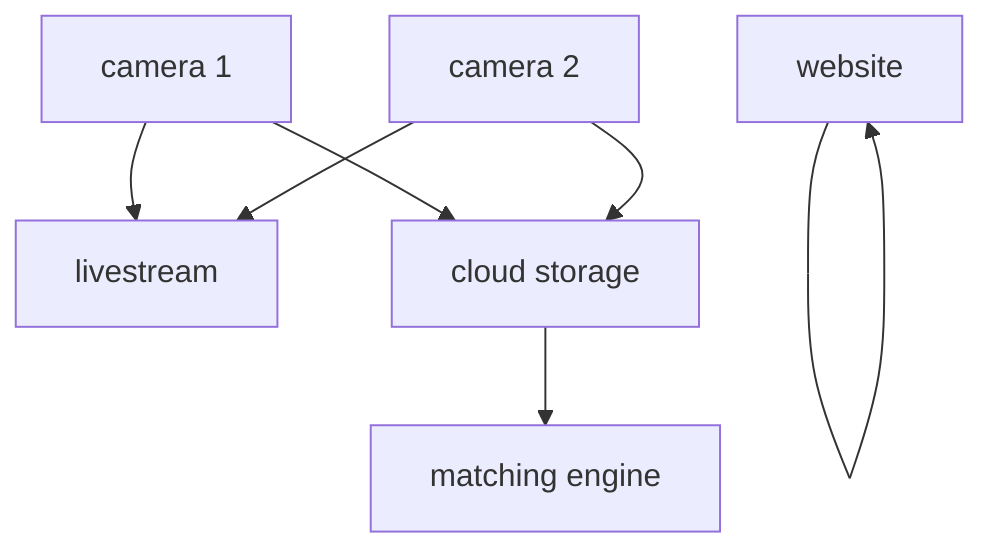

README for UKMON Archive

```mermaid
    flowchart TD
    A[camera 1] --> C[livestream];
    B[camera 2] --> C[livestream];
    A[camera 1] --> D[cloud storage];
    B[camera 2] --> D[cloud storage];
    D[cloud storage] --> E[matching engine];
    F[matching engine] --> F[website];
```
