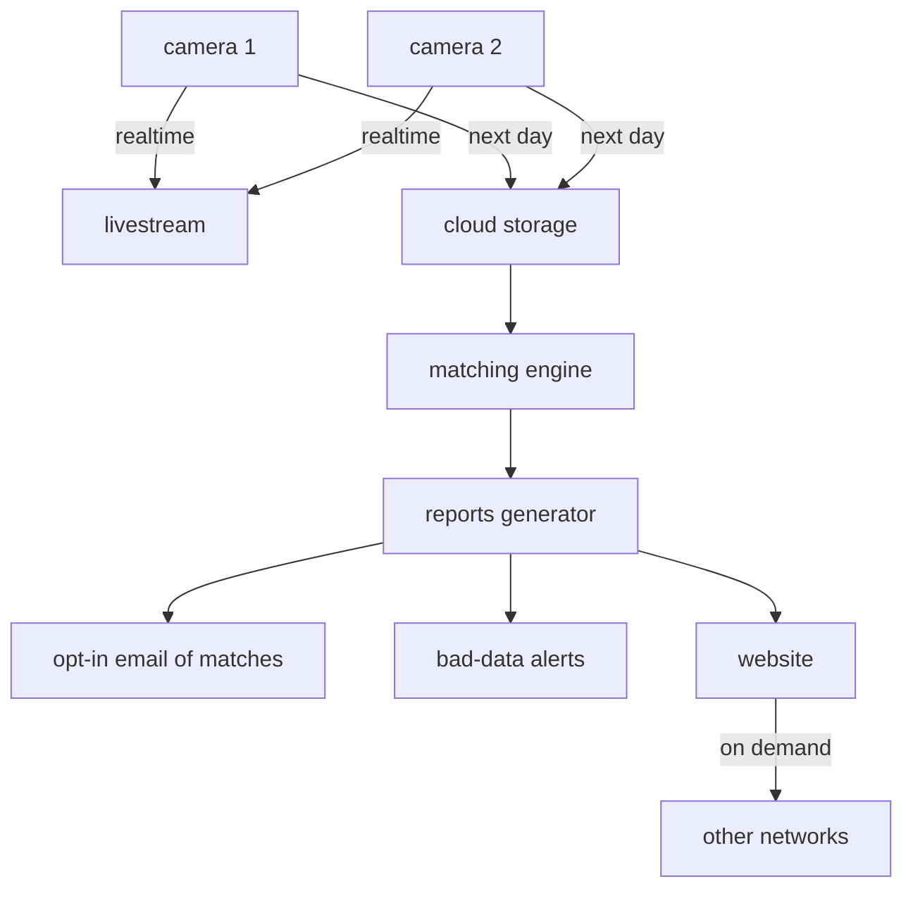

README for UKMON Archive

```mermaid
    flowchart TD
    A[camera 1] -- realtime --> C[livestream];
    B[camera 2] -- realtime --> C[livestream];
    A[camera 1] -- next day --> D[cloud storage];
    B[camera 2] -- next day --> D[cloud storage];
    D[cloud storage] --> E[matching engine];
    E[matching engine] --> F[reports generator];
    F[reports generator] --> G[opt-in email of matches];
    F[reports generator] --> I[bad-data alerts];
    F[reports generator] --> H[website];
    H[website] -- on demand -->J[other networks];
```